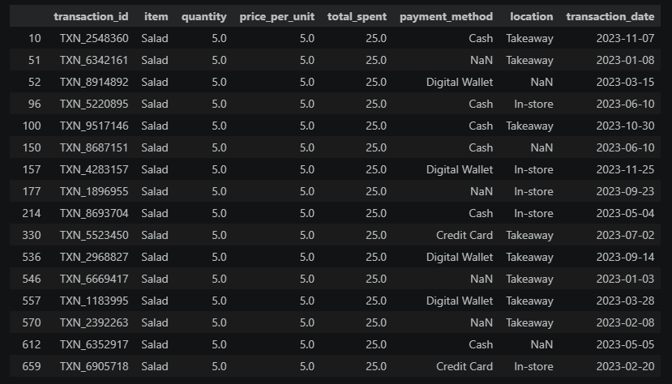
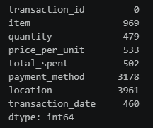
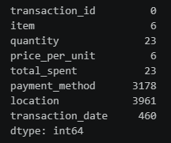

# Cafe_Sale_Dataset_Cleaning
🧹 A hands-on data cleaning project using pandas and numpy on a messy cafe sales dataset from Kaggle. The goal wasn't just to produce a clean dataset, but to practice diagnosing why data is missing or inconsistent, and to make deliberate, defensible decisions about how to handle each case — rather than blindly filling every gap.

# Dataset
- **Source:** [Kaggle — Dirty Cafe Sales Dataset](https://www.kaggle.com/datasets/ahmedmohamed2003/cafe-sales-dirty-data-for-cleaning-training)
- **Size:** 10000 rows and 8 columns
- **Columns:** Transaction ID, Item, Quantity, Price Per Unit, Total Spent, Payment Method, Location, Transaction Date

The raw data included several layers of "dirtiness":

- Standard missing values (empty cells)
- Hidden missing values disguised as the strings "UNKNOWN" and "ERROR" instead of true NaN
- Numeric columns (Quantity, Price Per Unit, Total Spent) read as text because of these mixed-in strings
- A date column read as plain text instead of datetime

# Cleaning Process
1. Loading & normalizing missing values

Read the CSV with na_values=['UNKNOWN', 'ERROR', ' '] so hidden nulls are converted to real NaN at load time. This also let pandas automatically infer the correct numeric dtypes for Quantity, Price Per Unit, and Total Spent.

2. Fixing data types

Converted Transaction Date from string to datetime64 using pd.to_datetime(), enabling proper date-based operations (filtering, sorting, extracting month/day, etc.).

3. Reconstructing numeric values via formula

Since "Total Spent = Quantity × Price Per Unit", missing values in any one of these three columns could often be recovered mathematically from the other two. This recovered the vast majority of missing values in these columns — far more reliable than filling with a mean or median, since it's based on the row's own actual data.
4. Cross-filling Item ↔ Price Per Unit

Several prices map to exactly one menu item (e.g. 1.0 → Cookie, 5.0 → Salad), so missing Item values could be inferred from Price Per Unit, and vice versa. Two prices (3.0 and 4.0) each map to two possible items, so those were intentionally excluded from this direct mapping and handled separately (see below).

Because the price-item fill and the formula-based reconstruction (step 3) can each unlock new information for the other, the formula step was run a second time after the item/price cross-fill — this caught additional rows where, for example, Price Per Unit was only recoverable after Item had already been filled in.

5. Labeling genuinely ambiguous values

For rows priced at 3.0 or 4.0 with a missing Item, there isn't enough information to know whether the item was Cake/Juice or Smoothie/Sandwich. Rather than guessing randomly (which would fabricate data that looks real but isn't), these were explicitly labeled 'Ambiguous' — signaling "we know the problem, but not the exact answer."

6. Leaving irreducible missing values as NaN

For values with no relationship to any other column — Payment Method, Location, and the small remainder of Item/Quantity/Price Per Unit/Total Spent that couldn't be recovered by any of the above — no imputation was applied. Filling these with a random guess or the column mode would create false precision and quietly bias any downstream analysis. Rather than treat "unrecoverable" and "gapfilled" the same way, this data is left as NaN, kept honest about what's genuinely unknown.

7. Outlier check

Used the IQR method to flag statistical outliers in Quantity, Price Per Unit, and Total Spent. Total Spent had 268 flagged values (e.g. 5 × 5 = 25), but manual verification confirmed these are all legitimate large orders — the multiplication is correct, and Quantity/Price Per Unit themselves have no outliers. These rows were kept, since "statistically unusual" isn't the same as "wrong."

  

8. Validation

Before exporting, confirmed that Total Spent == Quantity × Price Per Unit holds for all rows that have complete data (9,974 of 10,000) — 100% consistency, confirming the reconstruction logic introduced no errors.

# Key Decisions 
| Situation                                         | Decision                       | Why                                                       |
| :------------------------------------------------ | :----------------------------- | :-------------------------------------------------------- |
| Hidden nulls (`UNKNOWN`/`ERROR`)                  | Converted to `NaN` at load     | Makes missingness explicit and machine-readable           |
| Missing numeric value, derivable via formula      | Calculated from other two cols | Exact, not a guess                                        |
| Missing `Item`, price maps to one item            | Filled with that item          | Unambiguous relationship                                  |
| Missing `Item`, price maps to two items (3.0/4.0) | Labeled `'Ambiguous'`          | Partial information — we know the problem, not the answer |
| Missing `Payment Method` / `Location`             | Left as `NaN`                  | No related column to infer from — filling would fabricate |
| Remaining unrecoverable numeric/`Item` values     | Left as `NaN`                  | Same reasoning — consistent handling across the dataset   |
| Statistical outliers in `Total Spent`             | Kept                           | Verified mathematically valid, not data errors            |

### Before & After

<table align="center" style="margin: 20px auto;">
  <caption style="caption-side: top; font-size: 22px; font-weight: bold; padding-bottom: 10px;">
    Cleaning Before and After
  </caption>
  <tr>
    <td align="center" valign="top"><b>Before</b></td>
    <td align="center" valign="top"><b>After</b></td>
  </tr>
  <tr>
    <td align="center" valign="top">
      
    </td>
    <td align="center" valign="top">
      
    </td>
  </tr>
</table>

# Tools Used
- pandas — data loading, cleaning, transformation
- numpy — outlier bound calculations (IQR)

# Files
- dirty_cafe_sales.csv — original raw dataset
- dirty_cafe_sales_data_cleaning.ipynb — full cleaning notebook
- cleaned_cafe_sales_dataset.csv — final cleaned output

## Status

✅ **Completed** — Last updated: September 2026